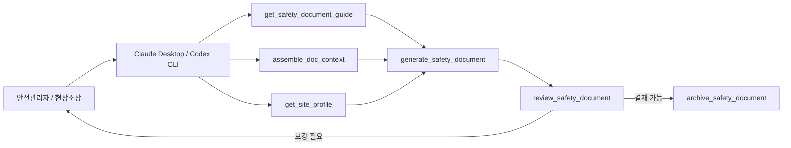

# agent-safety-oss

[](https://github.com/ratelworks/agent-safety-oss/actions/workflows/ci.yml)
[](https://github.com/ratelworks/agent-safety-oss/actions/workflows/codeql.yml)
[](./LICENSE)
[](https://nodejs.org)
[](https://modelcontextprotocol.io)
[](./CHANGELOG.md)
[](./docs/IDENTITY.md)

**건설현장의 법정 안전문서 작성을 더 빠르고 정확하게.** 산안법·기준규칙·중처법·KOSHA Guide를 기반으로 안전관리자와 현장소장의 문서 작성과 검토를 돕는 오픈소스 도구입니다.

안전관리자·현장소장이 매일·매주·매월 작성하는 **19종 법정 안전관리 문서** (TBM·작업계획서·위험성평가·MSDS·산재조사표 등) 를 옆에서 돕습니다. **안전관리 법령 8개 본문** (산안법·시행령·시행규칙·기준규칙·중처법·중처법 시행령·위험성평가 고시·건진법 §62 영역) + **KOSHA Guide 1,039건 본문** (offline, keyless) + 부처별 분산 공공데이터 (법제처·KOSHA·고용노동부·국토부) 를 같은 온톨로지 그래프로 통합해, 작성 시점에 양식·빈칸 가이드·법령 본문 발췌·검수를 자동 제공합니다.

**Claude Desktop · OpenAI Codex CLI** 두 host 를 메인 지원합니다. `npm` 한 줄로 동작합니다. **작성 주체는 안전관리자, MCP 는 보조**.

[English](./README-EN.md) · [정체성](./docs/IDENTITY.md) · [운영 온톨로지](./docs/OPERATIONAL-ONTOLOGY.md) · [Claude Desktop 설정](./docs/SETUP_CLAUDE_DESKTOP.md) · [Codex CLI 설정](./docs/SETUP_CODEX.md)

---

## 5초 진입 — MCP host 사용자 (Claude Desktop · Codex)

이미 MCP host 를 쓰는 안전관리자라면 아래 설정만 추가하면 끝납니다. **88개 도구가 모두 동작** (대부분 키 없이 offline · 공공 OpenAPI 7개만 라텔웍스 발행 키 필요).

### Claude Desktop (JSON 설정)

설정 파일에 다음을 추가:
```json
{
  "mcpServers": {
    "agent-safety-oss": {
      "command": "npx",
      "args": ["-y", "agent-safety-oss", "serve"]
    }
  }
}
```

설정 파일 위치:
- **macOS**: `~/Library/Application Support/Claude/claude_desktop_config.json`
- **Windows**: `%APPDATA%\Claude\claude_desktop_config.json`

저장 후 Claude Desktop 을 완전 종료·재시작하면 도구 목록에 `agent-safety-oss` 가 보입니다.

### OpenAI Codex CLI (TOML 설정)

`~/.codex/config.toml` 에 다음을 추가:
```toml
[mcp_servers.agent-safety-oss]
command = "npx"
args = ["-y", "agent-safety-oss", "serve"]
```

Codex CLI 재시작 후 `codex mcp list` 로 등록 확인.

자세한 안내:
- [docs/SETUP_CLAUDE_DESKTOP.md](./docs/SETUP_CLAUDE_DESKTOP.md)
- [docs/SETUP_CODEX.md](./docs/SETUP_CODEX.md)
- 더 많은 예시: [examples/](./examples/)

## 누구를 위한 것인가

### 안전관리자

- TBM, 위험성평가, 작업계획서, 작업허가서, MSDS 대장, 점검표, 사고보고서 초안을 만든다.
- 법령, KOSHA Guide, 위험요인, 통제대책, 양식, 보존기간을 한 번에 확인한다.
- LLM이 작성한 문서의 법령 인용, 필수 항목, 결재 가능 여부를 검수한다.
- 사진 증빙, 안전 이슈, 개선조치, 운영 보고서를 로컬 기록으로 남긴다.

### 현장소장

- 오늘 작업의 위험, 필요한 보호구, 작업 전 조치, 작업허가 필요 여부를 빠르게 본다.
- 사고 발생 시 보고 순서와 제출 문서를 시간순으로 확인한다.
- 안전관리자가 부재하거나 겸임일 때도 최소한의 안전관리 문서 흐름을 놓치지 않는다.

### 신규 담당자

- 기존 담당자의 폴더 구조와 기억에 묶인 맥락을 `profile`, `drafts`, `documents`, `photos`, `issues`, `actions`, `reports`로 이어받는다.

## 왜 필요한가

건설 현장의 안전관리 자료는 보통 이렇게 흩어져 있습니다.

```text
법령 조문
KOSHA Guide
위험성평가표
TBM 일지
작업계획서
작업허가서
MSDS
현장 사진
개선조치
보고서
```

자료는 존재하지만 서로 연결되지 않으면, 안전관리 품질은 시스템보다 담당자의 경험과 기억에 의존합니다. `agent-safety-oss`는 이 자료들을 다음 사슬로 연결합니다.

```text
작업 -> 위험요인 -> 통제대책 -> 법령 근거 -> 문서 -> 증빙 -> 개선조치 -> 보고
```

LLM은 이 그래프를 보고 문서를 작성하거나 설명할 수 있지만, 법령 근거를 임의로 만들지는 않습니다. 필수 항목이 비어 있으면 결재 불가 또는 보강 필요로 표시하고, 근거 없는 법적 표현은 검수 도구가 잡아냅니다.

## 자동작성 흐름

사용자는 자연어로 요청하고, Agent는 MCP 도구를 순서대로 호출합니다. 핵심은 문서를 바로 "그럴듯하게" 쓰는 것이 아니라, 그래프 컨텍스트를 먼저 조립하고, 초안을 만들고, 검수한 뒤 보관하는 것입니다.



자동작성은 다음 순서로 이해하면 됩니다.

1. 사용자가 "오늘 굴착 작업 TBM 만들어줘"처럼 요청한다.
2. Agent가 `get_safety_document_guide`로 양식 구조와 필수 항목을 확인한다.
3. Agent가 `assemble_doc_context`로 법령, 위험요인, 통제대책, KOSHA Guide, 관련 문서를 가져온다.
4. 등록된 현장 프로파일이 있으면 `get_site_profile` 결과로 사업장명, 현장명, 결재선을 채운다.
5. `generate_safety_document`가 초안을 만든다.
6. `review_safety_document`가 필수 항목, 법령 인용, 결재 가능 여부를 점검한다.
7. 사용자가 보강하거나 승인하면 `archive_safety_document`로 로컬에 보관한다.

예를 들어 TBM 요청은 내부적으로 이런 흐름이 됩니다.

```text
사용자:
  오늘 4층 발코니 거푸집 양중 작업 TBM 만들어줘.

Agent:
  get_safety_document_guide({ docId: "daily_tbm" })
  assemble_doc_context({ docId: "daily_tbm" })
  get_site_profile()
  generate_safety_document({ docId: "daily_tbm", draft: ... })
  review_safety_document({ docId: "daily_tbm", draft: ... })

결과:
  TBM 초안
  주요 위험요인
  통제대책
  필요 보호구
  법령/KOSHA 근거
  미작성 필수 항목
  결재 가능 여부
```

폼 UI와 함께 쓰는 경우에는 `render_a2ui_form`, `save_form_draft`, `load_form_draft`를 같이 사용합니다.

```text
render_a2ui_form        docId 기반 입력 폼 생성
save_form_draft         Agent 또는 사용자가 입력한 값을 임시 저장
load_form_draft         사용자가 수정한 값을 Agent가 다시 읽음
submit_safety_document  A2UI 입력값을 실제 문서 생성 흐름으로 제출
generate_safety_document
review_safety_document
archive_safety_document
```

## A2UI 폼 — 브라우저에서 보기

`render_a2ui_form` 이 만드는 폼을 [Google A2UI](https://github.com/google/a2ui) v0.9 JSONL 로 그대로 브라우저에서 시각화할 수 있습니다. 안전관리자가 빈칸·플레이스홀더·법령 근거가 자동 표시된 폼을 실제로 보고 입력해보는 데 유용합니다.

```bash
npm install
npm run build
npm run mcp:demo:viewer
# → http://localhost:5174 자동 시작
```

브라우저에서 폼 종류 (TBM 회의록 / 굴착 작업계획서 / 정기 위험성평가 등) 를 선택하면, 빈칸·예시·법령 인용까지 자동으로 채워진 입력 폼이 렌더링됩니다.

JSONL 만 따로 받아 정적 뷰어 (`a2ui-demo/index.html`) 에 붙여넣는 방법도 있습니다 — 자세한 안내는 [`a2ui-demo/README.md`](./a2ui-demo/README.md).

## 빠른 시작

Node.js 20.19 이상이 필요합니다. 아래 두 트랙 중 본인 환경에 맞는 것을 선택하세요.

### Track A — Claude Desktop 사용자 (안전관리자·현장소장 권장)

위 "5초 진입" 카드 참고. `npx` 가 자동으로 패키지를 받아 실행하므로 별도 설치 명령이 필요 없습니다.

소스 빌드본을 직접 연결할 때는 다음처럼 지정합니다.

```json
{
  "mcpServers": {
    "agent-safety-oss": {
      "command": "node",
      "args": ["/absolute/path/to/agent-safety-oss/build/cli.js", "serve"]
    }
  }
}
```

### Track B — 터미널 / CI / 개발자

> **현재 상태**: npm registry publish 전 (`npm view agent-safety-oss` E404). 아래 npx/`npm install -g` 명령은 publish 후 동작합니다. 현재는 GitHub clone + build 경로를 사용하세요.

```bash
# 현재 권장 — GitHub clone + build (publish 전)
git clone https://github.com/ratelworks/agent-safety-oss.git
cd agent-safety-oss
npm ci && npm run build
node build/cli.js tools
node build/cli.js serve

# npm publish 후 (v1.x 예정)
# npx -y agent-safety-oss tools
# npx -y agent-safety-oss serve
# npm install -g agent-safety-oss
```

CLI 사용 예시는 [`examples/`](./examples/) 폴더의 `mcp-list-tools.sh`, `search-laws.sh`, `generate-tbm.sh` 참고.

### 공공 데이터 연결 — 12+ source, 11개 도구

본 OSS 는 한국 공공 OpenAPI 와 portal 을 그래프 작성 보조에 통합합니다.

**연결된 공공 데이터 source (12+)**:

| Source | 영역 | 호출 도구 |
|---|---|---|
| KOSHA OneAPI 15121001 / 15121008 | 재해사례 + 첨부 | `search_accident_cases` · `get_accident_case_attachments` |
| KOSHA OneAPI 15133935 | 건설 사망사고 통계 | `search_construction_fatal_accidents` |
| KOSHA OneAPI 15119137 | 전 업종 사망사고 | `search_all_fatal_accidents` |
| KOSHA OneAPI 15139398 | 안전보건자료실 (외국인 13개국어) | `search_safety_materials` · `get_foreign_worker_resource_links` |
| KOSHA OneAPI 15001197 | MSDS (화학물질안전) | `search_msds` |
| KOSHA OneAPI 15139497 | 보호구 안전인증 (KCs) | `search_ppe_certification` |
| KOSHA OneAPI 15123696 | 안전보건법령 스마트검색 (AI 유사어) | `search_safety_law_smart` |
| KOSHA OneAPI 15144147 | KOSHA Guide PDF 다운로드 (현재 번들 1,039) | (offline 번들로 대체) |
| KOSHA OneAPI 15087828 | 건설 공종 분류 (구조 분류) | `analyze_construction_work_risks` (fallback) |
| KOSHA OneAPI 15116595 | 공종 ↔ KOSHA Guide 매핑 | `analyze_construction_work_risks` (fallback) |
| KOSHA OneAPI 15140383 | SIF 아카이브 (사망 고위험요인) | `search_sif_archive` |
| KOSHA portal24 | 안전보건자료실 8,976건 (OPS·동영상·교안) | `search_kosha_archive` · `list_kosha_archive_facets` · `get_kosha_archive_files` |
| 법제처 OpenAPI (law.go.kr) | 안전관리 법령 본문 (현재 8 본문 번들) | (offline 번들 + 향후 동적 확장) |

**키 없이 즉시 동작 — 81개 도구**:
- 8 법령 본문 번들 검색 (`search_safety_laws`, `get_safety_law_article`, `list_core_safety_laws`)
- 1,039 KOSHA Guide 본문 offline 조회 (`get_kosha_guide_md`)
- 그래프 traversal (`assemble_doc_context`, `generate_safety_document`, `review_safety_document`)
- 19종 법정문서 작성 보조 (위험성평가·작업계획서·TBM·MSDS·작업허가서 등)
- 로컬 현장 기록 (사진·이슈·조치·보고)

**키 필요 — 7개 도구** (KOSHA OneAPI 실시간 호출):

| 도구 | 영역 |
|---|---|
| `search_accident_cases` | 국내 재해사례 검색 |
| `get_accident_case_attachments` | 재해사례 첨부 자료 |
| `search_construction_fatal_accidents` | 건설 사망사고 |
| `search_all_fatal_accidents` | 전 업종 사망사고 |
| `search_safety_materials` | 안전보건자료 (외국인 자료 포함) |
| `search_msds` | MSDS (화학물질) |
| `search_ppe_certification` | 보호구 안전인증 |

#### 키 발급 — 2 경로

| 경로 | 방법 |
|---|---|
| **A. 라텔웍스 발행 키** | <https://ratelworks.co.kr/agenthq/api-key> 에서 무료 즉시 발급 (`ASF_xxxx_yyyy`). 단일 키로 7 도구 + KOSHA portal 호출 |
| **B. 자체 data.go.kr 키** | data.go.kr 에서 KOSHA OpenAPI 즉시 신청·발급. `.env` 에 `DATA_GO_KR_KEY=...` 설정 |

자세한 설정: `.env.example` + [docs/SETUP_CLAUDE_DESKTOP.md](./docs/SETUP_CLAUDE_DESKTOP.md).

#### 향후 추가 가능 공공 데이터

본 OSS 는 현재 12+ source 를 통합했으나, 다음 공공 데이터도 그래프 통합 후보입니다 (contributor 환영):

- **법제처 OpenAPI** 동적 확장 (안전 외 인접 법령 — 산업안전기준에 관한 규칙 외)
- **KOSHA-MS** 안전보건경영시스템 인증 사업장 명부
- **KCs/KCs Self** 안전인증·자율안전인증 통합 (현재 보호구만)
- **고용노동부** 산업재해 통계연보 (분기·연도별 추이)
- **국토교통부** 건설공사 안전관리 종합정보망 (CSI)
- **환경부** 화학물질 정보 (PRTR · 유해성 등급)
- **소방청** 위험물 안전관리 정보
- **건설근로자공제회** 안전교육 이수 자료

추가 요청은 [Issue](https://github.com/ratelworks/agent-safety-oss/issues) 로 제안 가능.

#### 키 등록 (A 경로)

| 방법 | 동작 |
|---|---|
| 방법 1 — Claude 에 한국어로: "라텔웍스에서 받은 AgentHQ 키 `ASF_xxxx` 를 등록해줘" | `link_company_key` 도구가 호출되어 `~/.agent-safety-oss/company-key.json` 저장 |
| 방법 2 — 환경변수 | `AGENTHQ_API_KEY=ASF_xxxx` |

## 실제 사용 예시

Claude Desktop이나 Codex에서 자연어로 요청합니다.

```text
우리 현장은 30억, 상시 12명 건설현장이야.
이번 달 작성해야 할 안전보건 문서와 보관기간을 정리해줘.
```

```text
오늘 4층 발코니 거푸집 양중 작업 TBM 만들어줘.
추락, 낙하물, 신호수 배치, 필요한 보호구까지 포함해줘.
```

```text
신너 600을 도장 작업에 쓰는데 MSDS 비치대장 초안을 만들어줘.
법령 근거, 교육, 게시 위치, 필요한 보호구도 같이 넣어줘.
```

```text
중대재해가 발생했을 때 지금부터 어떤 보고를 몇 시간 안에 해야 하는지 알려줘.
```

Agent는 내부적으로 다음 도구들을 조합합니다.

```text
assess_my_obligations
list_safety_documents_by_cycle
get_safety_document_guide
assemble_doc_context
generate_safety_document
review_safety_document
verify_safety_basis
archive_safety_document
```

## 현장 운영 흐름

### 1. 현장 프로파일 등록

한 번 등록하면 19종 법정문서 (94 docId 마스터) 의 사업장명, 현장명, 대표자, 안전관리자, 현장소장, 결재선이 자동 채워집니다.

```text
register_site
register_project
register_person
register_equipment
register_contractor
```

예시 요청:

```text
우리 회사 사업장 정보를 등록해줘.
사업장명은 황룡건설, 대표자는 황한일이야.
현장은 천안 신축현장, 공사금액은 30억, 상시근로자는 12명이야.
안전관리자는 김안전, 현장소장은 이소장이야.
```

### 2. 의무 확인

사업장 규모, 공사금액, 업종, 공사 단계에 따라 적용 문서와 마감, 보관기간을 확인합니다.

```text
assess_my_obligations
list_safety_documents_by_cycle
list_upcoming_duties
query_applicability
get_submission_info
get_retention_status
```

### 3. 문서 작성

문서 하나를 만들 때 법령, 위험요인, 통제대책, KOSHA Guide, 관련 문서, 보존기간을 그래프에서 조립합니다.

```text
get_safety_document_guide
assemble_doc_context
generate_safety_document
export_drafted_document
get_official_form
```

자동작성에서 가장 중요한 도구는 `assemble_doc_context`와 `generate_safety_document`의 조합입니다. 전자는 LLM이 추측하지 않도록 근거를 모으고, 후자는 그 근거를 결재 가능한 Markdown 문서로 합성합니다.

### 4. 검수

필수 항목 누락, 결재 가능 여부, 법령 인용 실존 여부, 근거 없는 법적 표현을 점검합니다.

```text
review_safety_document
verify_safety_basis
query_legal_basis
query_penalty
```

### 5. 사진, 이슈, 개선조치

법정문서와 별개로 현장 운영 기록을 남깁니다.

```text
upload_photo_evidence
register_safety_issue
record_corrective_action
complete_action
generate_safety_report
```

## 들어 있는 것

- 패키지 버전: 1.3.0
- MCP 도구: 88개
- 법정의무 문서 마스터: 94 docId
- 풀가이드: 19개
- 양식 인덱스: 132 formId
- 자동 생성 양식: 94개 Markdown 양식
- 공식/참조 양식 인덱스 (`forms-map.json`): HWP 14 / PDF 23 / XLSX 1 (실제 번들 원본: HWP 8 / PDF 11 / XLSX 1 — 나머지는 공식 다운로드 URL 안내)
- 운영 그래프: 3,336 노드 / 29,642 엣지
- 핵심 작업/위험/통제: WorkActivity 41 / Hazard 38 / Control 45
- 법령 본문 번들: **8개 MD** — 산안법·시행령·시행규칙·기준규칙·중처법·중처법 시행령·위험성평가 고시·건진법 §62 영역 (`src/ontology/safety-laws/*.md`)

## 온톨로지 설계

이 프로젝트는 세 계층을 분리합니다.

| 계층 | 역할 | 예 |
|---|---|---|
| Semantic Layer | 안전관리 객체와 관계 | Site, Project, WorkActivity, Hazard, Control, LegalArticle, SafetyDocument |
| Kinetic Layer | 그래프 객체에 대한 실행 도구 | `generate_safety_document`, `review_safety_document`, `register_safety_issue` |
| Dynamic Layer | LLM과 하네스의 상황 해석과 도구 조합 | Claude Desktop, OpenAI Codex CLI |

핵심 사슬은 다음과 같습니다.

```text
WorkActivity -> Hazard -> Control
SafetyDocument -> LegalArticle
SafetyDocument -> KOSHA Guide
PhotoEvidence -> SafetyIssue -> CorrectiveAction -> SafetyReport
```

표준은 JSON-LD, RDF/OWL, SKOS, PROV-O, schema.org, ISO 45001 관점을 사용하되, 런타임은 무거운 그래프 DB 없이 로컬 파일과 MCP 도구로 동작합니다.

## 근거 등급

| 근거 | 등급 | 문서에서의 의미 |
|---|---|---|
| 법령, 시행령, 시행규칙, 고시 | mandatory | 의무 판단과 제출 문서의 법적 근거 |
| KOSHA Guide | recommended | 기술적 권고와 작업 방법 |
| 재해사례, 안전보건자료, MSDS, 통계, 보호구 인증 | reference | 참고 자료와 교육 자료 |

LLM이 "의무", "반드시", "금지", "위반" 같은 표현을 쓰면 `verify_safety_basis`가 법령 근거를 요구합니다.

## 로컬 저장소

사용자 데이터는 기본적으로 로컬에 저장됩니다.

```text
~/.agent-safety-oss/
  profile.jsonld       사업장/현장/인원/장비 프로파일
  drafts/              작성 중 초안
  documents/           보관 문서
  photos/              사진 증빙
  issues/              안전 이슈
  actions/             개선조치
  reports/             운영 보고서
  traces/              실행 추적
```

디렉터리는 `0o700`, 파일은 `0o600` 권한으로 생성됩니다.

## 검증 상태

최근 검증 결과:

- 운영 온톨로지: 38/38 통과
- 그래프 추론: 5/5 통과
- 그래프 recall / precision: 100% / 100%
- ISO 45001 카테고리 일관성: 100%
- strict graph audit: 통과
- 필드 워크플로우: 4/4 시나리오, 29/29 단계 통과
- 실제 입력 반응성: 4/4 시나리오 통과, 입력 문구 반영 S1 7/7 · S2 7/7 · S3 6/6 · S4 6/6
- 현장 사용자 테스터: 안전관리자/현장소장 수기 체크리스트와 피드백 양식 생성
- 생성 문서 품질: 평균 8.65/10
- essence gate: 9/9 통과
- lightweight gate: 4/4 통과

검증 명령:

```bash
npm run typecheck
npm run build
npm run ontology:operational
npm run mcp:test:graph
npm run mcp:test:real-input
npm run mcp:test:field-user
npm run audit:strict
npx tsx scripts/test/field-test-workflows.ts
npx tsx scripts/quality/field-test-quality-eval.ts
```

## 현장 사용자 테스터

실제 안전관리자나 현장소장이 생성 문서를 검토하듯 테스트하려면 다음 명령을 실행합니다.

```bash
npm run mcp:test:field-user
```

결과는 `artifacts/test-results/field-user-tester/`에 생성됩니다. 각 시나리오에는 실제 입력값, MCP 생성 문서, 자동 검토 결과, 수기 체크리스트, 피드백 양식이 함께 들어갑니다.

```text
01-input.json              실제 현장 입력
02-generated.md            생성 문서
03-review.txt              자동 검토 결과
04-human-checklist.md      안전관리자/현장소장 수기 체크리스트
05-feedback-template.json  현장 피드백 기록 양식
06-auto-evaluation.json    자동 판정 결과
```

테스터는 자동 통과 여부를 제공하지만, 최종 판단은 `04-human-checklist.md`의 수기 점수와 현장 피드백을 우선합니다.

## 현재 한계

- `safety_health_manager_appointment`는 19종 법정문서 중 CARV 추론 완성도 보강 대상으로 남아 있습니다.
- `regular_risk_assessment`는 실제 입력 반영과 KRAS 결과표 작성은 통과하지만, 사용자 입력 `riskRows`에서 Hazard를 동적으로 역추론하는 깊이는 보강 대상입니다.
- Site, Project, Contractor, WorkerRole은 런타임 프로파일 중심이며 정적 그래프 노드 물질화는 다음 단계입니다.
- 사진 외 EvidenceType, 예를 들어 서명, 교육 참석, 제출 영수증, 점검 결과 증빙은 더 확장해야 합니다.
- 최종 법적 판단, 서명, 제출 책임은 안전관리자와 사업장 책임자에게 있습니다.

## 개발 환경

```bash
git clone https://github.com/ratelworks/agent-safety-oss.git
cd agent-safety-oss
npm install
npm run build
npm run typecheck
npm run mcp:tools
```

## 제공 · 개발

- **제공**: 황룡건설(주) 안전보건기획부 — 도메인 검증·현장 요구사항·시나리오 제공
- **개발**: 주식회사 라텔웍스 (Ratelworks Inc.) — MCP 서버 설계·구현·오픈소스 유지. 공공 안전자료 접근성 개선. <alphamale@ratelworks.co.kr>

## 수상 이력

- **2025.07** — 2025 AI·스마트 산업안전기술 우수사례 경진대회 **대상** (고용노동부장관상) · 황룡건설(주), 개발 ㈜라텔웍스
- **2025.09** — 2025 위험성평가 우수사례 발표대회 **우수상** (대전지방고용노동청장상) · 황룡건설(주), 개발 ㈜라텔웍스
- **2026.01** — 사이드임팩트 2025 AI 트랙 **우승** (브라이언임팩트재단) · ㈜라텔웍스

## 라이선스

- 코드: MIT
- 법령 본문: 저작권법 제7조 비보호 저작물
- KOSHA/고용노동부 공개자료: 각 자료의 공공누리 조건 준수

자세한 출처와 재사용 조건은 [NOTICE.md](./NOTICE.md)를 확인하십시오.
