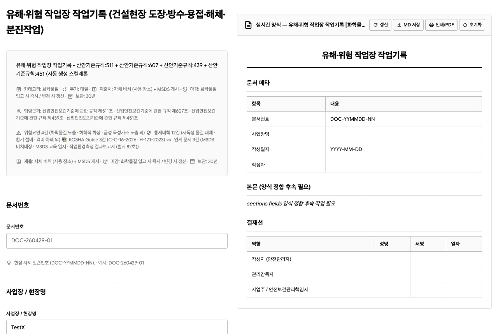
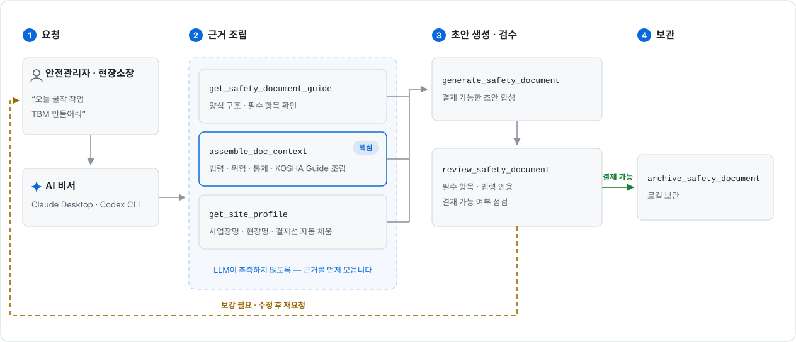

# agent-safety-oss

[](https://github.com/ratelworks/agent-safety-oss/actions/workflows/ci.yml)
[](https://github.com/ratelworks/agent-safety-oss/actions/workflows/codeql.yml)
[](./LICENSE)
[](https://nodejs.org)
[](https://modelcontextprotocol.io)
[](./CHANGELOG.md)
[](./docs/IDENTITY.md)

**건설현장의 법정 안전문서 작성을 더 빠르고 정확하게.** 산안법·기준규칙·중처법·KOSHA 기술지원규정(가이드)을 기반으로 안전관리자와 현장소장의 문서 작성과 검토를 돕는 오픈소스 도구입니다.

[정체성](./docs/IDENTITY.md) · [Claude Desktop 설정](./docs/SETUP_CLAUDE_DESKTOP.md) · [Codex CLI 설정](./docs/SETUP_CODEX.md) · [데이터 출처](./docs/DATA_SOURCES.md) · [기술 상세 (운영 온톨로지)](./docs/OPERATIONAL-ONTOLOGY.md)

---

**목차** — [한 눈에](#한-눈에--안전관리자가-받는-가치) · [왜 필요한가](#왜-필요한가) · [무엇이 들어 있나](#무엇이-들어-있나) · [시작하기](#시작하기) · [사용 예시](#사용-예시) · [자동작성 흐름](#어떻게-동작하나--자동작성-흐름) · [현장 운영 흐름](#현장-운영-흐름) · [공공 데이터 연결](#공공-데이터-연결) · [근거 등급과 검수](#신뢰성--근거-등급과-검수) · [검증 상태](#검증-상태) · [현재 한계](#현재-한계) · [기술 상세](#기술-상세--온톨로지-설계) · [기여](#개발--기여) · [라이선스](#라이선스)

---

## 한 눈에 — 안전관리자가 받는 가치

> CLI(명령어 입력) 환경이 익숙하지 않아도 됩니다. AI 비서 (Claude Desktop · OpenAI Codex CLI) 가 본 도구를 호출해서 다음을 자동으로 해 줍니다.

| 사용자가 하는 일 | AI 비서가 자동으로 해 주는 일 |
|---|---|
| "**오늘 굴착 작업 TBM 만들어줘**" 한 줄 요청 | 적용 KOSHA 가이드 5건 + 법령 6건 + 위험 3건 + 통제 16건 자동 발견 → 결재 가능한 초안 자동 작성 → 빠진 필수 항목 자동 검출 |
| "**추락 산재 발생 보고**" 요청 | 산안법 §54·§57 등 법령 자동 인용 + 사고조사 기술지침 자동 인용 + 시간순 제출 순서 안내 |
| "**MSDS 비치대장**" 요청 | 산안법 §114·§115 + KOSHA 화학물질 경고표지 가이드 + 보호구 자동 표시 |

**누구를 위한 것인가:**

- **안전관리자** — TBM·위험성평가·작업계획서·MSDS 대장·사고보고서 초안 작성, 법령·KOSHA Guide·양식·보존기간 일괄 확인, LLM 작성 문서의 법령 인용·필수 항목 검수
- **현장소장** — 오늘 작업의 위험·보호구·작업 전 조치·작업허가 필요 여부 확인, 사고 발생 시 보고 순서와 제출 문서를 시간순으로 확인
- **신규 담당자** — 전임자의 폴더와 기억에 묶인 맥락을 `profile` · `drafts` · `documents` · `photos` · `issues` · `actions` · `reports` 로 이어받기

**작성 주체는 안전관리자, AI 비서는 옆에서 보조** (법적 판단·서명·제출 책임은 사람). 본 도구가 의무 문서를 자동 생성하더라도 결재 전 안전관리자 검토는 필수입니다.



*`npx -y agent-safety-oss viewer` 한 줄로 뜨는 브라우저 입력 폼 — 적용 법령 조문·보존기간·결재선이 자동 채워지고, 오른쪽에 결재 가능한 문서가 실시간 미리보기됩니다. ([B. 브라우저 입력 폼](#b-브라우저-입력-폼--ai-비서cli-불필요) 참조)*

## 왜 필요한가

건설 현장의 안전관리 자료는 보통 이렇게 흩어져 있습니다.

```text
법령 조문 · KOSHA Guide · 위험성평가표 · TBM 일지 · 작업계획서
작업허가서 · MSDS · 현장 사진 · 개선조치 · 보고서
```

자료는 존재하지만 서로 연결되지 않으면, 안전관리 품질은 시스템보다 담당자의 경험과 기억에 의존합니다. `agent-safety-oss`는 이 자료들을 다음 사슬로 연결합니다.

```text
작업 -> 위험요인 -> 통제대책 -> 법령 근거 -> 문서 -> 증빙 -> 개선조치 -> 보고
```

LLM은 이 그래프를 보고 문서를 작성하거나 설명할 수 있지만, 법령 근거를 임의로 만들지는 않습니다. 필수 항목이 비어 있으면 결재 불가 또는 보강 필요로 표시하고, 근거 없는 법적 표현은 검수 도구가 잡아냅니다.

## 무엇이 들어 있나

| 영역 | 내용 |
|---|---|
| **<!-- INV:DOCUMENTS_TOTAL -->19<!-- /INV:DOCUMENTS_TOTAL -->종 법정 안전관리 문서** | TBM · 작업계획서 · 위험성평가 · MSDS · 산재조사표 등 매일·매주·매월 작성하는 양식. docId 마스터 <!-- INV:DOCID_MASTER -->94<!-- /INV:DOCID_MASTER -->개 (19종 + 사이클·범위·발주처별 변형) |
| **법령 <!-- INV:LAW_BUNDLE_COUNT -->10<!-- /INV:LAW_BUNDLE_COUNT -->건 핵심 조문** | 산안법 · 시행령 · 시행규칙 · 기준규칙 · 중처법 · 중처법 시행령 · 위험성평가 고시 · 건진법 등 합계 <!-- INV:LAW_ARTICLES -->76<!-- /INV:LAW_ARTICLES -->조 (전체 1,310조 중 건설안전 실무 핵심만 발췌. 전체 법령은 [법제처](https://www.law.go.kr) 직접 참조). 마지막 동기화: <!-- INV:LAW_LAST_SYNC -->2026-06-08<!-- /INV:LAW_LAST_SYNC --> |
| **KOSHA 기술지원규정 (가이드) <!-- INV:KOSHA_BODY -->1,039<!-- /INV:KOSHA_BODY -->건** | 한국산업안전보건공단 발행 기술지침 전체 본문 (인터넷 없이 즉시 검색·인용) |
| **양식 <!-- INV:FORMS_TOTAL -->132<!-- /INV:FORMS_TOTAL -->개** | 고용노동부·KOSHA 공식 HWP <!-- INV:FORMS_HWP -->14<!-- /INV:FORMS_HWP --> / PDF <!-- INV:FORMS_PDF -->23<!-- /INV:FORMS_PDF --> / XLSX <!-- INV:FORMS_XLSX -->1<!-- /INV:FORMS_XLSX --> 원본 + 자동 생성 Markdown 양식 <!-- INV:FORMS_MD -->94<!-- /INV:FORMS_MD -->개 (일부는 라이선스상 공식 다운로드 URL 안내로 대체) |
| **MCP 도구 <!-- INV:TOOLS_TOTAL -->92<!-- /INV:TOOLS_TOTAL -->개** | 키 없이 바로 쓰는 <!-- INV:TOOLS_KEYLESS -->85<!-- /INV:TOOLS_KEYLESS -->개 + 공공 API 키 필요 <!-- INV:TOOLS_KEYREQ -->7<!-- /INV:TOOLS_KEYREQ -->개 (그중 <!-- INV:TOOLS_PLACEHOLDER -->2<!-- /INV:TOOLS_PLACEHOLDER -->개는 공공누리 라이선스 사유로 다운로드 URL 안내만 하는 placeholder) |
| **위험·통제 정보망** | 작업 → 위험요인 → 통제대책 → 법령 근거 → 문서 자동 연결. 그래프 노드 <!-- INV:GRAPH_TOTAL -->3,369<!-- /INV:GRAPH_TOTAL -->개 (카테고리 1단계 <!-- INV:GRAPH_TOPLEVEL -->2,212<!-- /INV:GRAPH_TOPLEVEL --> + KOSHA Guide 1,039) · 엣지 약 <!-- INV:GRAPH_EDGES -->32,963<!-- /INV:GRAPH_EDGES --> · WorkActivity <!-- INV:GRAPH_ACTIVITIES -->41<!-- /INV:GRAPH_ACTIVITIES --> / Hazard <!-- INV:GRAPH_HAZARDS -->38<!-- /INV:GRAPH_HAZARDS --> / Control <!-- INV:GRAPH_CONTROLS -->50<!-- /INV:GRAPH_CONTROLS --> |

→ 위 자료들이 **서로 연결**되어 있어, "굴착 작업"이라는 한 단어만 알면 적용 법령·KOSHA 가이드·위험·통제·양식이 자동으로 따라옵니다. (패키지 버전: <!-- INV:VERSION -->1.7.0<!-- /INV:VERSION -->)

## 시작하기

Node.js 20.19 이상이 필요합니다 ([nodejs.org](https://nodejs.org)). 환경에 맞는 경로 하나를 고르세요.

| 사용자 환경 | 진입 경로 | 난이도 |
|---|---|:---:|
| **Claude Desktop / OpenAI Codex CLI 이미 쓰는 분** (개발자 · IT 익숙) | [A. AI 비서에 연결](#a-ai-비서에-연결--claude-desktop--openai-codex-cli) — 설정 한 블록 복사 | ⭐ 5초 |
| **AI 비서가 뭔지 모르는 분** (안전관리자 · 현장소장) | [📖 Claude Desktop 설정 가이드](./docs/SETUP_CLAUDE_DESKTOP.md) — 그림 따라하기 | ⭐⭐ 5분 |
| **브라우저 폼만 쓰고 싶은 분** (AI 비서·CLI 모두 불필요) | [B. 브라우저 입력 폼](#b-브라우저-입력-폼--ai-비서cli-불필요) — `npx` 한 줄 | ⭐ 10초 |
| **터미널 · CI · 개발자** | [C. 터미널 · 개발자](#c-터미널--ci--개발자) | ⭐ |

### A. AI 비서에 연결 — Claude Desktop / OpenAI Codex CLI

> **"AI 비서 도구 연결 표준" (MCP) 을 지원하는 앱**의 설정 파일에 아래 한 블록을 추가하면 끝납니다. <!-- INV:TOOLS_TOTAL -->92<!-- /INV:TOOLS_TOTAL -->개 도구가 모두 동작합니다 (<!-- INV:TOOLS_KEYLESS -->85<!-- /INV:TOOLS_KEYLESS -->개는 인터넷 없이 동작, <!-- INV:TOOLS_KEYREQ -->7<!-- /INV:TOOLS_KEYREQ -->개만 공공 OpenAPI 키 필요).

**Claude Desktop (JSON 설정)** — 설정 파일에 다음을 추가:

```json
{
  "mcpServers": {
    "agent-safety-oss": {
      "command": "npx",
      "args": ["-y", "agent-safety-oss", "serve"]
    }
  }
}
```

설정 파일 위치:
- **macOS**: `~/Library/Application Support/Claude/claude_desktop_config.json`
- **Windows**: `%APPDATA%\Claude\claude_desktop_config.json`

저장 후 Claude Desktop 을 완전 종료·재시작하면 도구 목록에 `agent-safety-oss` 가 보입니다.

**OpenAI Codex CLI (TOML 설정)** — `~/.codex/config.toml` 에 다음을 추가:

```toml
[mcp_servers.agent-safety-oss]
command = "npx"
args = ["-y", "agent-safety-oss", "serve"]
```

Codex CLI 재시작 후 `codex mcp list` 로 등록 확인.

소스 빌드본을 직접 연결할 때는 `command: "node"`, `args: ["/absolute/path/to/agent-safety-oss/build/cli.js", "serve"]` 로 바꾸면 됩니다.

자세한 안내: [docs/SETUP_CLAUDE_DESKTOP.md](./docs/SETUP_CLAUDE_DESKTOP.md) · [docs/SETUP_CODEX.md](./docs/SETUP_CODEX.md) · 더 많은 예시: [examples/](./examples/)

### B. 브라우저 입력 폼 — AI 비서·CLI 불필요

> **CLI(명령어 입력)가 익숙하지 않은 안전관리자·현장소장이 가장 편하게 쓰는 방법.** 브라우저 화면에 입력 양식이 뜨고, 법령 근거·KOSHA 가이드·위험요인·통제대책이 미리 채워져 있습니다. 빈 칸만 채우면 결재 가능한 문서가 자동 생성됩니다.

실행 — **한 줄이면 됩니다** (설치·빌드·git clone 모두 불필요):

```bash
npx -y agent-safety-oss viewer
# → 브라우저가 자동으로 http://localhost:5174 열림
#   (자동으로 안 열리면 위 주소를 브라우저 주소창에 직접 입력)
#   다른 포트로 열려면:  PORT=5180 npx -y agent-safety-oss viewer
```

브라우저에서 보이는 화면:

1. **폼 종류 선택** (TBM 회의록 / 굴착 작업계획서 / 정기 위험성평가 / MSDS 비치대장 등 <!-- INV:DOCUMENTS_TOTAL -->19<!-- /INV:DOCUMENTS_TOTAL -->종)
2. **자동 표시되는 영역** (그대로 결재 인용 가능) — 적용 법령 조문 본문 발췌 · 적용 KOSHA 가이드 평균 5건 · 위험요인 + 통제대책 + 필요 보호구
3. **빈 칸 입력** — 작업일·작업명·참석자 등 사용자 입력 필요한 항목만 표시
4. **본문 생성** 버튼 → 결재 가능한 문서 자동 작성
5. **검수** → 빠진 필수 항목 / 결재 가능 여부 / 환각 차단 검증
6. **MD 다운로드** 또는 LocalStorage 보관

> PDF 출력이 필요하면 다운로드한 `.md` 를 [Pandoc](https://pandoc.org/) · 한글/한컴오피스 · [Typora](https://typora.io/) 등으로 변환합니다. 이 폼은 [Google A2UI](https://github.com/google/a2ui) v0.9 (Agent-UI 표준) 기반입니다.

### C. 터미널 · CI · 개발자

npm 에 publish 되어 있어 별도 설치 없이 `npx` 로 바로 실행됩니다 (설치된 최신 버전은 `npm view agent-safety-oss version` 으로 확인).

```bash
# npm publish 본 (즉시 실행)
npx -y agent-safety-oss tools
npx -y agent-safety-oss serve
# 또는 전역 설치
npm install -g agent-safety-oss

# 소스 빌드 (개발자 / fork)
git clone https://github.com/ratelworks/agent-safety-oss.git
cd agent-safety-oss
npm ci && npm run build
node build/cli.js tools
node build/cli.js serve
```

CLI 사용 예시는 [`examples/`](./examples/) 폴더의 `mcp-list-tools.sh`, `search-laws.sh`, `generate-tbm.sh` 참고.

## 사용 예시

Claude Desktop이나 Codex에서 자연어로 요청합니다.

```text
우리 현장은 30억, 상시 12명 건설현장이야.
이번 달 작성해야 할 안전보건 문서와 보관기간을 정리해줘.
```

```text
오늘 4층 발코니 거푸집 양중 작업 TBM 만들어줘.
추락, 낙하물, 신호수 배치, 필요한 보호구까지 포함해줘.
```

```text
신너 600을 도장 작업에 쓰는데 MSDS 비치대장 초안을 만들어줘.
법령 근거, 교육, 게시 위치, 필요한 보호구도 같이 넣어줘.
```

```text
중대재해가 발생했을 때 지금부터 어떤 보고를 몇 시간 안에 해야 하는지 알려줘.
```

Agent는 내부적으로 다음 도구들을 조합합니다.

```text
assess_my_obligations          사업장 규모·공사금액 기반 의무 판정
list_safety_documents_by_cycle 작성 주기별 문서 목록
get_safety_document_guide      양식 구조 + 필수 항목
assemble_doc_context           법령·위험·통제·KOSHA Guide 근거 조립
generate_safety_document       결재 가능한 초안 합성
review_safety_document         필수 항목·법령 인용·결재 가능 여부 점검
verify_safety_basis            근거 없는 법적 표현 차단
archive_safety_document        로컬 보관
```

## 어떻게 동작하나 — 자동작성 흐름

핵심은 문서를 바로 "그럴듯하게" 쓰는 것이 아니라, **그래프 컨텍스트를 먼저 조립하고, 초안을 만들고, 검수한 뒤 보관**하는 것입니다.

<picture>
  <source media="(prefers-color-scheme: dark)" srcset="./docs/assets/autowrite-flow-dark.svg">
  
</picture>

1. 사용자가 "오늘 굴착 작업 TBM 만들어줘"처럼 요청한다.
2. Agent가 `get_safety_document_guide`로 양식 구조와 필수 항목을 확인한다.
3. Agent가 `assemble_doc_context`로 법령, 위험요인, 통제대책, KOSHA Guide, 관련 문서를 가져온다.
4. 등록된 현장 프로파일이 있으면 `get_site_profile` 결과로 사업장명, 현장명, 결재선을 채운다.
5. `generate_safety_document`가 초안을 만든다.
6. `review_safety_document`가 필수 항목, 법령 인용, 결재 가능 여부를 점검한다.
7. 사용자가 보강하거나 승인하면 `archive_safety_document`로 로컬에 보관한다.

`assemble_doc_context`와 `generate_safety_document`의 조합이 핵심입니다 — 전자는 LLM이 추측하지 않도록 근거를 모으고, 후자는 그 근거를 결재 가능한 Markdown 문서로 합성합니다.

출력은 기본적으로 기존과 같은 Markdown입니다. 양식의 병합 셀·빈칸·법령 근거 연결까지 보존해 다른 LLM 검수나 문서 RAG에 넘기고 싶다면 `generate_safety_document` 호출 시 `format: "doclang"`을 지정할 수 있습니다. 이 DocLang v0.6 XML 출력은 현재 experimental 옵션입니다.

폼 UI([B. 브라우저 입력 폼](#b-브라우저-입력-폼--ai-비서cli-불필요))와 함께 쓰는 경우에는 `render_a2ui_form` (입력 폼 생성) → `save_form_draft` / `load_form_draft` (임시 저장·재로딩) → `submit_safety_document` (실제 문서 생성 흐름으로 제출) 를 같이 사용합니다.

## 현장 운영 흐름

| 단계 | 무엇을 하나 | 핵심 도구 |
|---|---|---|
| **1. 현장 프로파일 등록** | 한 번 등록하면 <!-- INV:DOCUMENTS_TOTAL -->19<!-- /INV:DOCUMENTS_TOTAL -->종 법정문서의 사업장명·현장명·대표자·안전관리자·현장소장·결재선이 자동 채워짐 | `register_site` · `register_project` · `register_person` · `register_equipment` · `register_contractor` |
| **2. 의무 확인** | 사업장 규모·공사금액·업종·공사 단계에 따라 적용 문서와 마감, 보관기간 확인 | `assess_my_obligations` · `list_safety_documents_by_cycle` · `list_upcoming_duties` · `query_applicability` · `get_submission_info` · `get_retention_status` |
| **3. 문서 작성** | 법령·위험요인·통제대책·KOSHA Guide·관련 문서·보존기간을 그래프에서 조립해 초안 작성 | `get_safety_document_guide` · `assemble_doc_context` · `generate_safety_document` · `export_drafted_document` · `get_official_form` |
| **4. 검수** | 필수 항목 누락, 결재 가능 여부, 법령 인용 실존 여부, 근거 없는 법적 표현 점검 | `review_safety_document` · `verify_safety_basis` · `query_legal_basis` · `query_penalty` |
| **5. 사진 · 이슈 · 개선조치** | 법정문서와 별개로 현장 운영 기록 (사진 증빙 → 이슈 → 조치 → 보고) | `upload_photo_evidence` · `register_safety_issue` · `record_corrective_action` · `complete_action` · `generate_safety_report` |

프로파일 등록 예시 요청:

```text
우리 회사 사업장 정보를 등록해줘.
사업장명은 황룡건설, 대표자는 황한일이야.
현장은 천안 신축현장, 공사금액은 30억, 상시근로자는 12명이야.
안전관리자는 김안전, 현장소장은 이소장이야.
```

## 공공 데이터 연결

본 OSS 는 한국 공공 OpenAPI 와 portal **13 source** 를 그래프 작성 보조에 통합합니다. source별 상세 매핑과 향후 추가 후보는 [docs/DATA_SOURCES.md](./docs/DATA_SOURCES.md) 참조.

**키 없이 즉시 동작 — <!-- INV:TOOLS_KEYLESS -->85<!-- /INV:TOOLS_KEYLESS -->개 도구**: 법령 <!-- INV:LAW_BUNDLE_COUNT -->10<!-- /INV:LAW_BUNDLE_COUNT -->건 본문 번들 검색 · KOSHA Guide <!-- INV:KOSHA_BODY -->1,039<!-- /INV:KOSHA_BODY -->건 offline 조회 · 그래프 traversal · 19종 법정문서 작성 보조 · 로컬 현장 기록.

**키 필요 — <!-- INV:TOOLS_KEYREQ -->7<!-- /INV:TOOLS_KEYREQ -->개 도구** (KOSHA OneAPI 실시간 호출):

| 도구 | 영역 |
|---|---|
| `search_accident_cases` · `get_accident_case_attachments` | 국내 재해사례 검색 + 첨부 자료 |
| `search_construction_fatal_accidents` · `search_all_fatal_accidents` | 건설 / 전 업종 사망사고 |
| `search_safety_materials` | 안전보건자료 (외국인 자료 포함) |
| `search_msds` | MSDS (화학물질) |
| `search_ppe_certification` | 보호구 안전인증 |

**키 발급 — 2 경로:**

| 경로 | 방법 |
|---|---|
| **A. 라텔웍스 발행 키** | <https://ratelworks.co.kr/agenthq/api-key> 에서 무료 즉시 발급 (`ASF_xxxx_yyyy`). 단일 키로 7 도구 + KOSHA portal 호출 |
| **B. 자체 data.go.kr 키** | data.go.kr 에서 KOSHA OpenAPI 즉시 신청·발급. `.env` 에 `DATA_GO_KR_KEY=...` 설정 |

**키 등록 (A 경로):** Claude 에 한국어로 "라텔웍스에서 받은 AgentHQ 키 `ASF_xxxx` 를 등록해줘" 라고 하면 `link_company_key` 도구가 `~/.agent-safety-oss/company-key.json` 에 저장합니다. 또는 환경변수 `AGENTHQ_API_KEY=ASF_xxxx`. 자세한 설정: `.env.example` + [docs/SETUP_CLAUDE_DESKTOP.md](./docs/SETUP_CLAUDE_DESKTOP.md).

## 신뢰성 — 근거 등급과 검수

| 근거 | 등급 | 문서에서의 의미 |
|---|---|---|
| 법령, 시행령, 시행규칙, 고시 | mandatory | 의무 판단과 제출 문서의 법적 근거 |
| KOSHA Guide | recommended | 기술적 권고와 작업 방법 |
| 재해사례, 안전보건자료, MSDS, 통계, 보호구 인증 | reference | 참고 자료와 교육 자료 |

LLM이 "의무", "반드시", "금지", "위반" 같은 표현을 쓰면 `verify_safety_basis`가 법령 근거를 요구합니다. 근거가 없으면 unsupported, 등급이 어긋나면 partial 로 표시됩니다.

**로컬 저장소** — 사용자 데이터는 기본적으로 로컬에 저장됩니다 (디렉터리 `0o700`, 파일 `0o600` 권한).

```text
~/.agent-safety-oss/
  profile.jsonld       사업장/현장/인원/장비 프로파일
  drafts/              작성 중 초안
  documents/           보관 문서
  photos/              사진 증빙
  issues/              안전 이슈
  actions/             개선조치
  reports/             운영 보고서
  traces/              실행 추적
```

## 검증 상태

최근 검증 결과:

- 운영 온톨로지: 41/41 통과 · 그래프 추론: 5/5 통과 · 그래프 recall / precision: 100% / 100%
- ISO 45001 카테고리 일관성: 100% · strict graph audit: 통과
- 필드 워크플로우: 4/4 시나리오, 29/29 단계 통과 · 실제 입력 반응성: 4/4 시나리오 통과
- 생성 문서 품질: 평균 8.65/10 · essence gate: 9/9 통과 · lightweight gate: 4/4 통과

핵심 검증 명령 (전체 목록과 CI 구성은 [CONTRIBUTING.md](./CONTRIBUTING.md) 참조):

```bash
npm run typecheck && npm run build
npm run test            # essence + lightweight + docs drift + smoke
npm run mcp:test:graph  # 그래프 추론·일관성·효과
npm run audit:strict    # 그래프 무결성 strict 감사
```

실제 안전관리자나 현장소장이 생성 문서를 검토하듯 테스트하려면 `npm run mcp:test:field-user` 를 실행합니다. 결과는 `artifacts/test-results/field-user-tester/` 에 시나리오별로 생성됩니다 (실제 입력값 · 생성 문서 · 자동 검토 결과 · 수기 체크리스트 · 피드백 양식). 자동 통과 여부를 제공하지만, 최종 판단은 수기 체크리스트의 점수와 현장 피드백을 우선합니다.

## 현재 한계

- `safety_health_manager_appointment`는 19종 법정문서 중 CARV 추론 완성도 보강 대상으로 남아 있습니다.
- `regular_risk_assessment`는 실제 입력 반영과 KRAS 결과표 작성은 통과하지만, 사용자 입력 `riskRows`에서 Hazard를 동적으로 역추론하는 깊이는 보강 대상입니다.
- Site, Project, Contractor, WorkerRole은 런타임 프로파일 중심이며 정적 그래프 노드 물질화는 다음 단계입니다.
- 사진 외 EvidenceType, 예를 들어 서명, 교육 참석, 제출 영수증, 점검 결과 증빙은 더 확장해야 합니다.
- 최종 법적 판단, 서명, 제출 책임은 안전관리자와 사업장 책임자에게 있습니다.

## 기술 상세 — 온톨로지 설계

> 이 섹션은 **개발자·기술 연구자용**입니다. 안전관리자·현장소장이 본 도구를 사용하는 데 이 내용을 알 필요는 없습니다.

이 프로젝트는 세 계층 (Layer) 으로 안전 정보를 표현합니다.

| 계층 | 역할 | 예 |
|---|---|---|
| Semantic Layer (의미 계층) | 안전관리 객체와 관계 정의 | Site, Project, WorkActivity, Hazard, Control, LegalArticle, SafetyDocument |
| Kinetic Layer (실행 계층) | 그래프 객체에 대한 실행 가능한 MCP 도구 | `generate_safety_document`, `review_safety_document`, `register_safety_issue` |
| Dynamic Layer (동적 계층) | LLM과 하네스의 상황 해석 + 도구 조합 | Claude Desktop, OpenAI Codex CLI |

핵심 의미 사슬 (안전 정보 자동 연결):

```text
WorkActivity (작업)  →  Hazard (위험)  →  Control (통제대책)
SafetyDocument (문서) →  LegalArticle (법령 조문)
SafetyDocument        →  KOSHA Guide (가이드)
PhotoEvidence (사진)  →  SafetyIssue (이슈) → CorrectiveAction (조치) → SafetyReport (보고)
```

채택 표준: JSON-LD 1.1, RDF/OWL, SKOS, PROV-O, schema.org, ISO 45001. 런타임은 무거운 그래프 DB 없이 로컬 파일 + MCP 도구로 동작합니다.

상세 문서: [아키텍처](./docs/ARCHITECTURE.md) · [운영 온톨로지](./docs/OPERATIONAL-ONTOLOGY.md) · [핵심 객체 13종 (정체성)](./docs/IDENTITY.md) · [API 스펙](./docs/API-SPECS.md) · [JSON-LD 작성 가이드](./docs/JSONLD-AUTHORING-GUIDE.md)

## 개발 · 기여

```bash
git clone https://github.com/ratelworks/agent-safety-oss.git
cd agent-safety-oss
npm install
npm run build
npm run typecheck
npm run mcp:tools
```

기여 절차·코딩 규칙·PR 체크리스트는 [CONTRIBUTING.md](./CONTRIBUTING.md), 보안 신고는 [SECURITY.md](./SECURITY.md) 를 참조하십시오. 새 공공 데이터 통합 제안은 [Issue](https://github.com/ratelworks/agent-safety-oss/issues) 로 환영합니다.

## 제공 · 개발

- **제공**: 황룡건설(주) 안전보건기획부 — 도메인 검증·현장 요구사항·시나리오 제공
  - 대표자: 황한일 · 주소: 충청남도 아산시 염치읍 충무로431번길 9
- **개발**: 주식회사 라텔웍스 (Ratelworks Inc.) — MCP 서버 설계·구현·오픈소스 유지. 공공 안전자료 접근성 개선. <alphamale@ratelworks.co.kr>

## 수상 이력

- **2025.07** — 2025 AI·스마트 산업안전기술 우수사례 경진대회 **대상** (고용노동부장관상) · 황룡건설(주), 개발 ㈜라텔웍스
- **2025.09** — 2025 위험성평가 우수사례 발표대회 **우수상** (대전지방고용노동청장상) · 황룡건설(주), 개발 ㈜라텔웍스
- **2026.01** — 사이드임팩트 2025 AI 트랙 **우승** (브라이언임팩트재단) · ㈜라텔웍스

## 라이선스

- 코드: MIT
- 법령 본문: 저작권법 제7조 비보호 저작물
- KOSHA/고용노동부 공개자료: 각 자료의 공공누리 조건 준수

자세한 출처와 재사용 조건은 [NOTICE.md](./NOTICE.md)를 확인하십시오.
